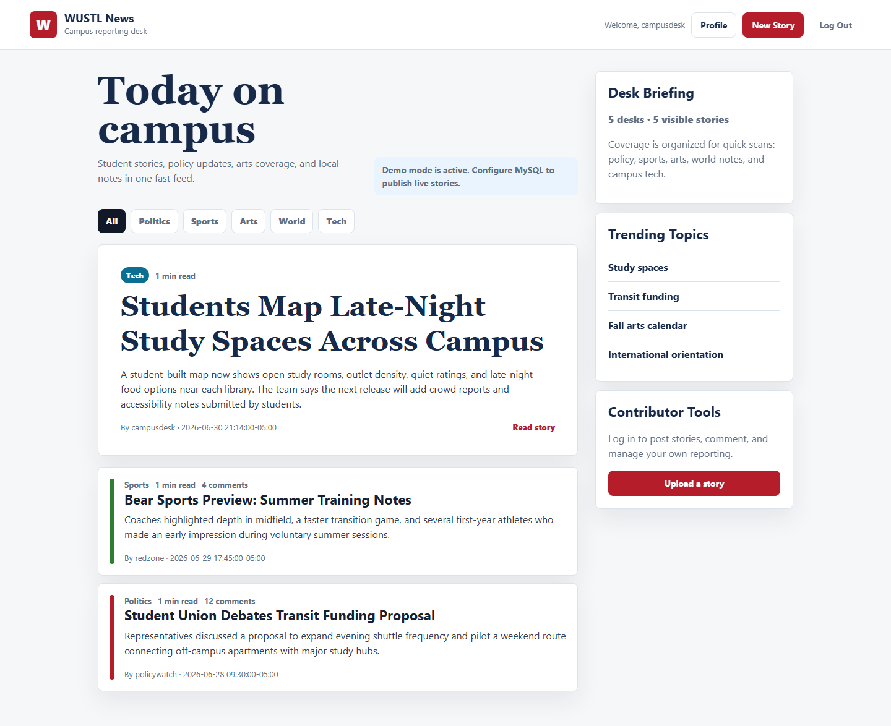
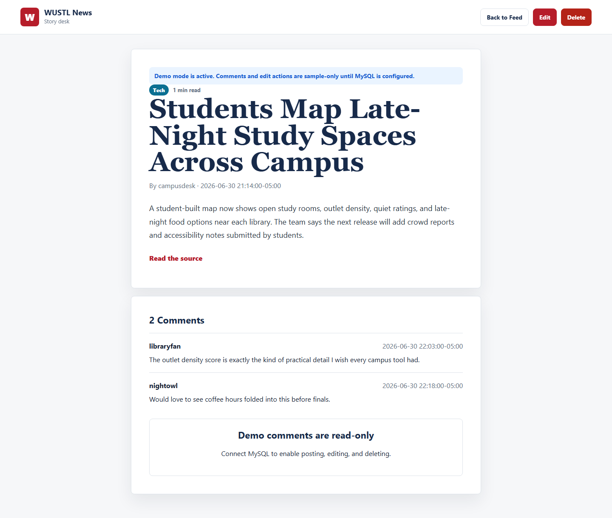

# WUSTL News

WUSTL News is a refreshed CSE 330 PHP news app. It is still intentionally simple: server-rendered PHP pages, MySQL for live content, and PHPUnit coverage for the helper layer. The interface has been revamped into a modern campus-news desk with category filters, a featured story, story detail pages, comments, contributor actions, and a built-in demo mode so the UI works before a database is configured.

## UI Screenshots

### Feed



### Story And Comments



The screenshots above show the refreshed demo-mode interface. The live app renders seeded demo stories and comments when MySQL is not configured. Connect a database when you want registration, login, posting, editing, and deleting to persist.

## What The App Does

- Shows a polished public news feed on `WustlNews.php`.
- Lets visitors filter stories by category: Politics, Sports, Entertainment, World, Technology, or All.
- Shows fake demo stories/comments automatically when the database is unavailable or empty.
- Lets users register, log in, and log out.
- Lets authenticated users upload stories with a title, category, content body, and optional URL.
- Lets authenticated users comment on stories.
- Lets story owners edit or delete their own stories.
- Lets comment owners edit or delete their own comments.
- Provides a user profile page that shows join date and stories uploaded by the selected user.
- Uses category-specific colors for story titles.
- Uses CSRF tokens on authenticated write flows.

## Project Structure

| Path | Purpose |
| --- | --- |
| `WustlNews.php` | Main story feed and category filter. |
| `WustlNewsLogin.php` | Login and logout flow. |
| `RegisterNewUser.php` | User registration flow. |
| `UploadStory.php` | Authenticated story creation form and insert logic. |
| `Story.php` | Single-story view, comments, story deletion, and comment deletion. |
| `EditStory.php` | Story-owner edit flow. |
| `EditComment.php` | Comment-owner edit flow. |
| `ViewProfile.php` | User profile and uploaded-story listing. |
| `database.php` | MySQL connection bootstrap using environment variables. Falls back to read-only demo mode when missing. |
| `src/NewsHelpers.php` | Unit-tested helper functions for escaping, validation, categories, demo data, excerpts, reading time, URLs, and CSRF checks. |
| `tests/NewsHelpersTest.php` | PHPUnit tests for the helper layer used by the PHP pages. |
| `.github/workflows/ci.yml` | GitHub Actions pipeline for tests, quality scanning, and security scanning. |
| `.github/dependabot.yml` | Dependabot configuration for Composer and GitHub Actions updates. |

## Data Model

The repository does not include a schema dump, but the PHP pages imply these MySQL tables:

| Table | Columns Used |
| --- | --- |
| `users` | `username`, `password`, `date_joined` |
| `stories` | `story_id`, `title`, `category`, `uploaded_by_user`, `date_uploaded`, `content`, `url` |
| `comments` | `comment_id`, `user`, `time`, `story`, `comment_text` |

Passwords are expected to be stored with PHP's `password_hash` and checked with `password_verify`.

## Quick Start: Demo UI

Use this when you just want to see the revamped interface without creating a database.

```bash
composer install
php -S 127.0.0.1:8000
```

Open:

```text
http://127.0.0.1:8000/WustlNews.php
```

With no database environment variables set, the feed and story pages use fake campus-news data. Demo mode is read-only: login, registration, story uploads, edits, deletes, and new comments require MySQL.

## Local Setup With MySQL

Install PHP 8.2+, Composer, and MySQL. Then install development dependencies:

```bash
composer install
```

Configure database access with environment variables:

```bash
export WUSTL_NEWS_DB_HOST=localhost
export WUSTL_NEWS_DB_USER=your_db_user
export WUSTL_NEWS_DB_PASSWORD=your_db_password
export WUSTL_NEWS_DB_NAME=newsSite
```

On PowerShell:

```powershell
$env:WUSTL_NEWS_DB_HOST = "localhost"
$env:WUSTL_NEWS_DB_USER = "your_db_user"
$env:WUSTL_NEWS_DB_PASSWORD = "your_db_password"
$env:WUSTL_NEWS_DB_NAME = "newsSite"
```

Create the MySQL schema expected by the legacy CSE 330 app:

```sql
CREATE TABLE users (
  username VARCHAR(64) PRIMARY KEY,
  password VARCHAR(255) NOT NULL,
  date_joined VARCHAR(40) NOT NULL
);

CREATE TABLE stories (
  story_id INT AUTO_INCREMENT PRIMARY KEY,
  title VARCHAR(150) NOT NULL,
  uploaded_by_user VARCHAR(64) NOT NULL,
  category VARCHAR(32) NOT NULL,
  content TEXT NOT NULL,
  date_uploaded VARCHAR(40) NOT NULL,
  url VARCHAR(2048) NULL
);

CREATE TABLE comments (
  comment_id INT AUTO_INCREMENT PRIMARY KEY,
  user VARCHAR(64) NOT NULL,
  time VARCHAR(40) NOT NULL,
  story INT NOT NULL,
  comment_text TEXT NOT NULL
);
```

Optional seed data for a live database:

```sql
INSERT INTO users (username, password, date_joined)
VALUES ('campusdesk', '$2y$10$exampleReplaceWithPasswordHash', '2026-06-01 09:00:00-05:00');

INSERT INTO stories (title, uploaded_by_user, category, content, date_uploaded, url)
VALUES
('Students Map Late-Night Study Spaces Across Campus', 'campusdesk', 'Technology', 'A student-built map now shows open study rooms, outlet density, quiet ratings, and late-night food options near each library.', '2026-06-30 21:14:00-05:00', 'https://example.com/study-map');
```

For real login testing, create users through `RegisterNewUser.php` so passwords are stored with PHP's `password_hash`.

## Build And Run Commands

There is no compiled build step for the PHP app. The install step is the dependency build:

```bash
composer install
```

Run the app:

```bash
php -S 127.0.0.1:8000
```

Then open:

```text
http://127.0.0.1:8000/WustlNews.php
```

Run tests:

```bash
composer test
```

Run tests with coverage:

```bash
composer test:coverage
```

Run static analysis:

```bash
composer analyse
```

For a production-style deployment, host the PHP files behind Apache or Nginx with PHP-FPM and point the app at a MySQL database containing the inferred tables above.

## Unit Tests

This repo has unit-tested PHP helper code in `src/NewsHelpers.php`. The tests cover:

- HTML escaping for user-controlled values.
- Username/password field validation.
- Story and comment text validation.
- Category normalization.
- Category labels and CSS classes.
- Demo story/comment data.
- Story filtering and lookup.
- Excerpts and reading-time estimates.
- Optional URL validation.

Run the unit tests:

```bash
composer test
```

Run tests with line coverage:

```bash
composer test:coverage
```

Run static analysis:

```bash
composer analyse
```

## GitHub Actions Pipeline

The CI workflow runs on pushes and pull requests targeting both `main` and `dev`.

### Unit Tests

The `Unit Tests` job:

- Checks out the repository.
- Sets up PHP 8.2 with Xdebug coverage.
- Validates `composer.json`.
- Caches Composer packages.
- Installs dependencies.
- Runs `composer test:coverage`.

### Code Scanning: Quality

The `Code Scanning / Quality` job:

- Installs the PHP toolchain.
- Runs PHPStan through `composer analyse`.
- Fails the workflow on static-analysis findings so quality issues are visible before merge.

### Code Scanning: Security

The `Code Scanning / Security` job:

- Runs Gitleaks secret scanning.
- Uploads Gitleaks SARIF results to GitHub code scanning.
- Runs GitHub's Dependency Review action on pull requests and fails on moderate-or-higher vulnerable dependency additions.

CodeQL is intentionally not configured for the PHP source because GitHub's current CodeQL documentation lists supported languages and explicitly excludes PHP. Dependency Review is available for public repositories and for private repositories with the required GitHub Code Security or Advanced Security entitlement.

### Dependency Automation

Dependabot is configured to open weekly update pull requests for:

- Composer dependencies.
- GitHub Actions versions.

## Notable Improvements Made

- Revamped the main feed into a responsive editorial interface with a sticky header, category tabs, featured story, latest-story rows, and a sidebar.
- Revamped the story page with article typography, comment cards, safer owner-only actions, and demo-mode messaging.
- Added read-only demo stories and comments so the UI works immediately without MySQL.
- Made database configuration non-fatal; the app now falls back to demo mode when credentials are missing or the connection fails.
- Added a small `src/` helper layer so core validation and escaping behavior can be unit tested.
- Replaced hardcoded database credentials with environment-variable configuration.
- Relaxed story/comment validation so normal sentences and multiline text work while rejecting empty/control-character input.
- Normalized category values so filtering and CSS category colors use consistent casing.
- Escaped more user-controlled output before rendering it into HTML.
- Fixed new-user registration to create a CSRF token for the authenticated session.
- Refreshed the CSS for a clearer, responsive interface.
