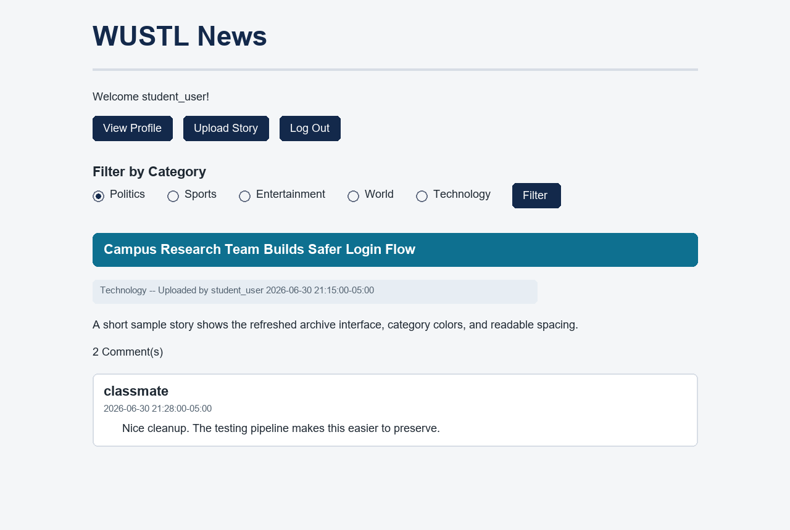

# WUSTL News

WUSTL News is an archived CSE 330 school assignment: a small PHP/MySQL news sharing site where registered users can post stories, comment on stories, and manage their own content. The original project was built as a multi-page PHP application with server-rendered HTML and a shared stylesheet.



The image above is a static preview of the refreshed interface. The live app still requires PHP and a MySQL database to render dynamic story, user, and comment data.

## What The App Does

- Shows a public news feed on `WustlNews.php`.
- Lets visitors filter stories by category: Politics, Sports, Entertainment, World, Technology, or All.
- Lets users register, log in, and log out.
- Lets authenticated users upload stories with a title, category, content body, and optional URL.
- Lets authenticated users comment on stories.
- Lets story owners edit or delete their own stories.
- Lets comment owners edit or delete their own comments.
- Provides a user profile page that shows join date and stories uploaded by the selected user.
- Uses category-specific colors for story titles.
- Uses CSRF tokens on authenticated write flows.

## Project Structure

| Path | Purpose |
| --- | --- |
| `WustlNews.php` | Main story feed and category filter. |
| `WustlNewsLogin.php` | Login and logout flow. |
| `RegisterNewUser.php` | User registration flow. |
| `UploadStory.php` | Authenticated story creation form and insert logic. |
| `Story.php` | Single-story view, comments, story deletion, and comment deletion. |
| `EditStory.php` | Story-owner edit flow. |
| `EditComment.php` | Comment-owner edit flow. |
| `ViewProfile.php` | User profile and uploaded-story listing. |
| `database.php` | MySQL connection bootstrap using environment variables. |
| `src/NewsHelpers.php` | Unit-tested helper functions for escaping, validation, categories, URLs, and CSRF checks. |
| `tests/NewsHelpersTest.php` | PHPUnit tests for the helper layer used by the PHP pages. |
| `.github/workflows/ci.yml` | GitHub Actions pipeline for tests, quality scanning, and security scanning. |
| `.github/dependabot.yml` | Dependabot configuration for Composer and GitHub Actions updates. |

## Data Model

The repository does not include a schema dump, but the PHP pages imply these MySQL tables:

| Table | Columns Used |
| --- | --- |
| `users` | `username`, `password`, `date_joined` |
| `stories` | `story_id`, `title`, `category`, `uploaded_by_user`, `date_uploaded`, `content`, `url` |
| `comments` | `comment_id`, `user`, `time`, `story`, `comment_text` |

Passwords are expected to be stored with PHP's `password_hash` and checked with `password_verify`.

## Local Setup

Install PHP 8.2+, Composer, and MySQL. Then install development dependencies:

```bash
composer install
```

Configure database access with environment variables:

```bash
export WUSTL_NEWS_DB_HOST=localhost
export WUSTL_NEWS_DB_USER=your_db_user
export WUSTL_NEWS_DB_PASSWORD=your_db_password
export WUSTL_NEWS_DB_NAME=newsSite
```

On PowerShell:

```powershell
$env:WUSTL_NEWS_DB_HOST = "localhost"
$env:WUSTL_NEWS_DB_USER = "your_db_user"
$env:WUSTL_NEWS_DB_PASSWORD = "your_db_password"
$env:WUSTL_NEWS_DB_NAME = "newsSite"
```

## Build And Launch

There is no compiled build step for the PHP app. The install step is the dependency build:

```bash
composer install
```

Launch the app with PHP's built-in development server:

```bash
php -S 127.0.0.1:8000
```

Then open:

```text
http://127.0.0.1:8000/WustlNews.php
```

For a production-style deployment, host the PHP files behind Apache or Nginx with PHP-FPM and point the app at a MySQL database containing the inferred tables above.

## Unit Tests

This repo now has unit-tested PHP helper code in `src/NewsHelpers.php`. The tests cover:

- HTML escaping for user-controlled values.
- Username/password field validation.
- Story and comment text validation.
- Category normalization.
- Optional URL validation.

Run the unit tests:

```bash
composer test
```

Run tests with line coverage:

```bash
composer test:coverage
```

Run static analysis:

```bash
composer analyse
```

## GitHub Actions Pipeline

The CI workflow runs on pushes and pull requests targeting both `main` and `dev`.

### Unit Tests

The `Unit Tests` job:

- Checks out the repository.
- Sets up PHP 8.2 with Xdebug coverage.
- Validates `composer.json`.
- Caches Composer packages.
- Installs dependencies.
- Runs `composer test:coverage`.

### Code Scanning: Quality

The `Code Scanning / Quality` job:

- Installs the PHP toolchain.
- Runs PHPStan through `composer analyse`.
- Fails the workflow on static-analysis findings so quality issues are visible before merge.

### Code Scanning: Security

The `Code Scanning / Security` job:

- Runs Gitleaks secret scanning.
- Uploads Gitleaks SARIF results to GitHub code scanning.
- Runs GitHub's Dependency Review action on pull requests and fails on moderate-or-higher vulnerable dependency additions.

CodeQL is intentionally not configured for the PHP source because GitHub's current CodeQL documentation lists supported languages and explicitly excludes PHP. Dependency Review is available for public repositories and for private repositories with the required GitHub Code Security or Advanced Security entitlement.

### Dependency Automation

Dependabot is configured to open weekly update pull requests for:

- Composer dependencies.
- GitHub Actions versions.

## Notable Improvements Made

- Added a small `src/` helper layer so core validation and escaping behavior can be unit tested.
- Replaced hardcoded database credentials with environment-variable configuration.
- Relaxed story/comment validation so normal sentences and multiline text work while rejecting empty/control-character input.
- Normalized category values so filtering and CSS category colors use consistent casing.
- Escaped more user-controlled output before rendering it into HTML.
- Fixed new-user registration to create a CSRF token for the authenticated session.
- Refreshed the CSS for a clearer, responsive interface.
